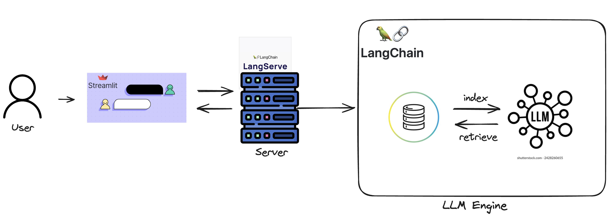

RAG 구조

진행방향
1. Data Collection <-
    - naver 뉴스 api에서 실시간 top 10위 뉴스를 긁어오자.
2. Data Embedding
3. Vector DB 구성 (Retrieval, Indexing)
4. LLM 설정
5. Prompt 설정
6. Chain 설정
7. UI 설정. 고려할 요소 Streaming, ChatHistory

Prompt

- [ ] : https 붙이기